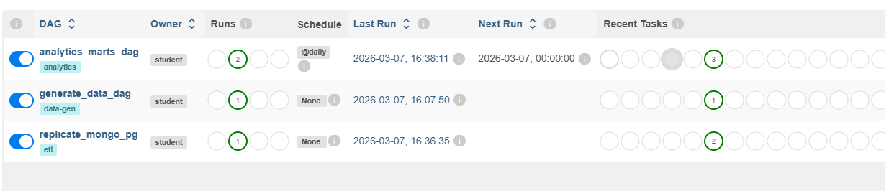
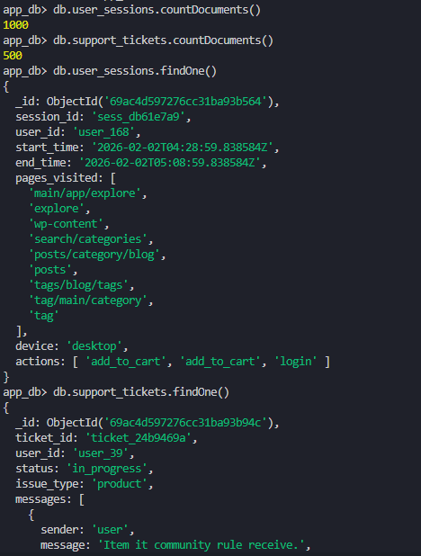
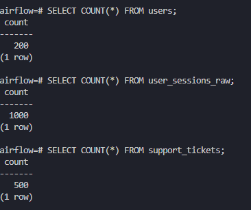
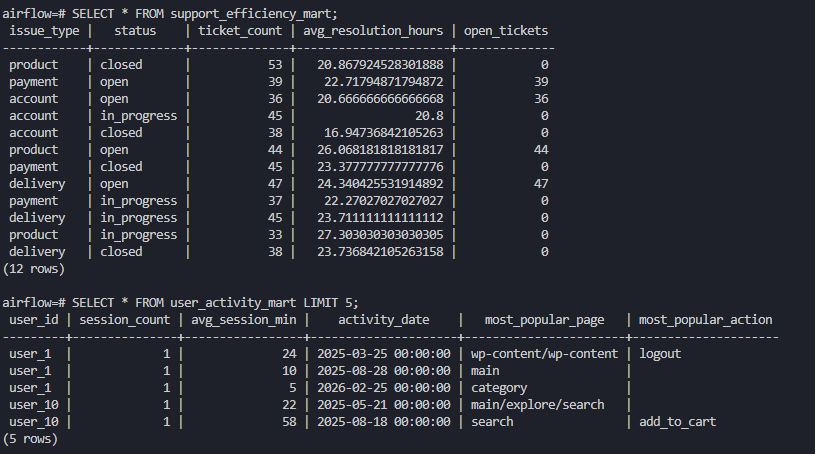

```bash
docker-compose down --volumes --remove-orphans
docker-compose build
docker-compose up airflow-init
docker-compose up -d        
```

Airflow UI: http://localhost:8080

Логин: admin
Пароль: admin



 ## postgres/init.sql создаёт:

- users(user_id) — уникальные пользователи;
- user_sessions_raw — сырые сессии пользователей (время, device, actions, duration);
- support_tickets — тикеты в поддержку (статус, тип, время решения).

## generate_data_dag.py заполняет user_sessions, support_tickets синтетическими данными:

- user_sessions: 1000
- support_tickets: 500
Перед генерацией коллекции очищаются



## replicate_mongo_pg_dag.py переносит данные из MongoDB в PostgreSQl, очищает и подготавливает их для аналитики

В DAG две задачи:

etl_sessions:
- читает user_sessions из MongoDB;
- удаляет дубли по session_id;
- приводит дату/время и считает duration в минутах;
- загружает:
  - уникальные user_id в таблицу users (ON CONFLICT DO NOTHING);
  - сессии в user_sessions_raw

etl_tickets:
- читает support_tickets из MongoDB;
- удаляет дубли по ticket_id;
- считает resolution_time_hours (updated_at − created_at);
- загружает:
  - user_id в users;
  - тикеты в support_tickets



## analytics_marts_dag:

- user_activity_mart — витрина активности пользователей с полями user_id, session_count, avg_session_min, activity_date, most_popular_page, most_popular_action
Витрина строится по таблице `user_sessions_raw`: данные агрегируются по `(user_id, activity_date)` с подсчётом количества сессий и средней длительности, а массивы `pages_visited` и `actions` разворачиваются через `unnest`, затем с помощью оконных функций выбирается самая популярная страница и действие для каждого пользователя в каждый день

- support_efficiency_mart — витрина эффективности поддержки с полями issue_type, status, ticket_count, avg_resolution_hours, open_tickets;
группировка по типу обращения и статусу, среднее время решения и количество открытых тикетов

