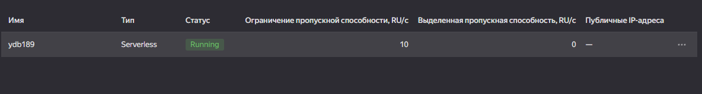
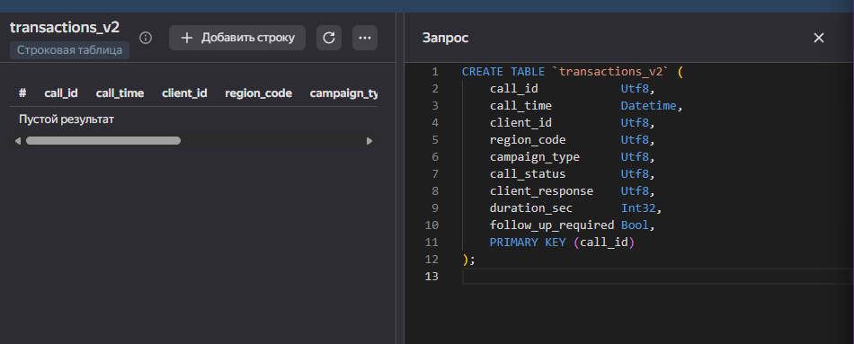
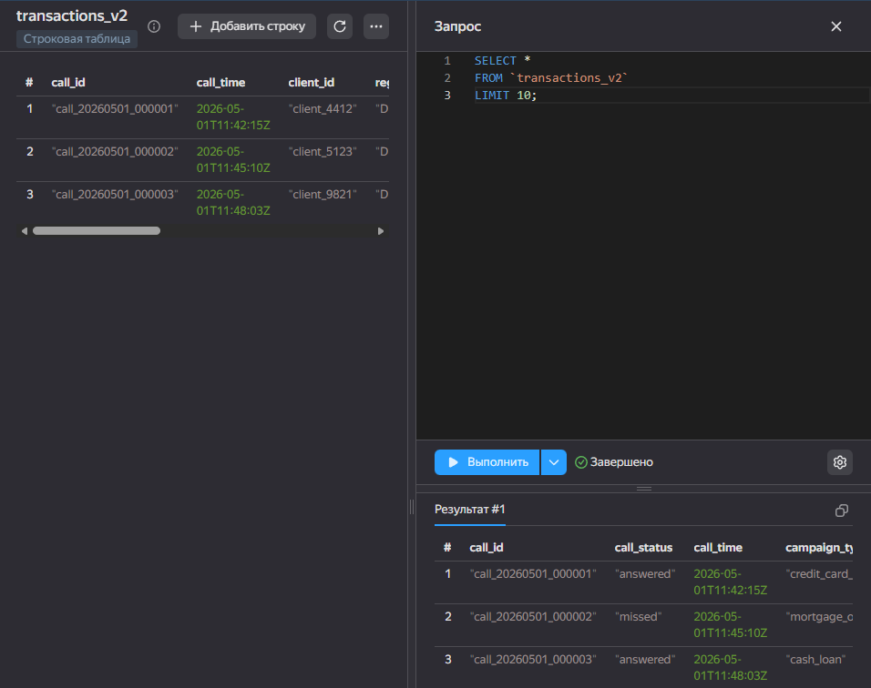
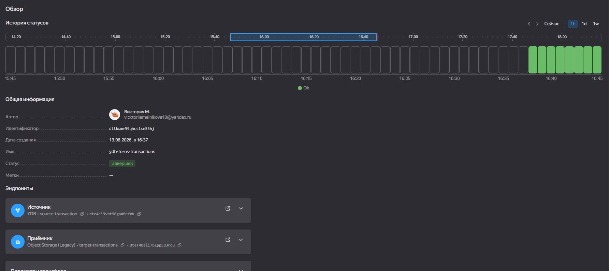

## Шаг 1. Managed Service for YDB

- Создана база данных в режиме **Serverless**.



### DDL таблицы

```sql
CREATE TABLE `transactions_v2` (
    call_id            Utf8,
    call_time          Datetime,
    client_id          Utf8,
    region_code        Utf8,
    campaign_type      Utf8,
    call_status        Utf8,
    client_response    Utf8,
    duration_sec       Int32,
    follow_up_required Bool,
    PRIMARY KEY (call_id)
);
```



---

## Шаг 2. Подготовка данных

Тестовый датасет сгенерирован скриптом data_sample.py.

| Параметр | Значение |
|---|---|
| Количество строк | 300 000 |
| Размер файла | ~31 МБ |
| Формат | CSV с заголовком |
| Регионы | DE-HE, DE-BY, DE-BW, DE-NW, DE-HH |
| Типы кампаний | credit_card_offer, mortgage_offer, cash_loan, insurance_offer |
| Статусы звонков | answered, missed, dropped |

Данные загружены в таблицу `transactions_v2` через пакетную вставку.
Пример INSERT: insert_transaction.sql



---

## Шаг 3. Object Storage

- Создан бакет **`etl-mel`** в каталоге `default`.
- Доступ: с авторизацией (приватный).
- Класс хранилища: Стандартное.

---

## Шаг 4. Сервисный аккаунт

Использован сервисный аккаунт **`etl`** со следующими ролями:

| Роль | Назначение |
|---|---|
| `data-transfer.admin` | Управление трансферами |
| `ydb.editor` | Чтение данных из YDB |
| `storage.editor` | Запись файлов в Object Storage |

---

## Шаг 5. Эндпоинты Data Transfer

### Источник — `source-transaction`

| Параметр | Значение |
|---|---|
| Тип | YDB |
| Направление | Источник |
| База данных | Managed Service for YDB (serverless) |
| Сервисный аккаунт | `etl` |

### Приёмник — `target-transactions`

| Параметр | Значение |
|---|---|
| Тип | Object Storage (Legacy) |
| Направление | Приёмник |
| Бакет | `etl-mel` |
| Сервисный аккаунт | `etl` |
| Выходной формат | CSV |
| Формат сжатия | Без сжатия |

---

## Шаг 6. Трансфер

| Параметр | Значение |
|---|---|
| Имя | `ydb-to-os-transactions` |
| Тип | Копирование (Snapshot) |
| Источник | `source-transaction` (YDB) |
| Приёмник | `target-transactions` (Object Storage) |

Трансфер активирован и успешно завершён.



---

## Задание 2 — Yandex Data Processing + Apache Airflow

### Входные данные

Файл `data/loans_input.csv` содержит **52 записи** о кредитах со следующими полями:

| Поле | Тип | Описание |
|---|---|---|
| `loan_id` | int | Уникальный ID кредита |
| `borrower_name` | string | ФИО заёмщика |
| `loan_amount` | double | Сумма кредита, руб. |
| `interest_rate` | double | Процентная ставка, % |
| `loan_term_months` | int | Срок кредита, месяцев |
| `issue_date` | date | Дата выдачи |
| `status` | string | Статус: active / paid / overdue |
| `region` | string | Регион заёмщика |

### PySpark-обработка (`scripts/process_loans.py`)

Скрипт выполняет следующие трансформации:

1. **Приведение типов** — числовые поля и даты
2. **Расчёт полной стоимости кредита** — `total_payment = loan_amount × (1 + rate × term / 12 / 100)`
3. **Категоризация** — `loan_category`: small / medium / large
4. **Возраст кредита** — `years_since_issue` (в годах от текущей даты)
5. **Флаг проблемного кредита** — `is_problem = true` для статуса `overdue`
6. **Агрегация по регионам** — количество, сумма, средняя ставка, число просроченных

**Результат:** 52 строки в `output/details/` + региональная статистика в `output/region_stats/`

### Airflow DAG (`dags/airflow_dag.py`)

- **DAG ID:** `loans_etl_pipeline`
- **Расписание:** `0 3 * * *` (ежедневно в 03:00 UTC)
- **Оператор:** `DataprocCreatePysparkJobOperator`
- **Кластер:** `dataproc102` (Yandex Data Processing)
- **Параметры Spark:** 2 executor core, 2g executor memory, 1g driver memory

### Инфраструктура Yandex Cloud

| Сервис | Ресурс | Параметры |
|---|---|---|
| Object Storage | `etl-mel` | Хранение входных данных, скриптов, результатов и DAG-файлов |
| Data Processing | `dataproc102` | 1 мастер + 2 воркера, сервисы: HDFS, YARN, Spark, TEZ |
| Managed Airflow | `airflow122` | Airflow 2.10, Python 3.12, бакет DAG: `etl-mel` |
| VPC | `default` / `ru-central1-e` | NAT включён через таблицу маршрутизации `nat-route-table` |
| Сервисный аккаунт | `dataproc` | Роли: `dataproc.agent`, `dataproc.editor`, `storage.editor`, `vpc.user` |

---

## Как воспроизвести

### 1. Загрузить файлы в Object Storage

```bash
# Данные
yc storage cp data/loans_input.csv s3://etl-mel/input/loans_input.csv

# Скрипт
yc storage cp scripts/process_loans.py s3://etl-mel/scripts/process_loans.py

# DAG
yc storage cp dags/airflow_dag.py s3://etl-mel/dags/airflow_dag.py
```

### 2. Запустить PySpark вручную (опционально)

```bash
yc dataproc job create-pyspark \
  --cluster-name dataproc102 \
  --main-python-file-uri s3a://etl-mel/scripts/process_loans.py \
  --args s3a://etl-mel/input/loans_input.csv \
  --args s3a://etl-mel/output/loans_processed
```

### 3. Проверить результат

```bash
yc storage ls s3://etl-mel/output/loans_processed/details/
yc storage ls s3://etl-mel/output/loans_processed/region_stats/
```

### 4. Проверить Airflow DAG

Открыть веб-интерфейс Airflow → раздел DAGs → `loans_etl_pipeline` → запустить вручную или дождаться расписания.

---

## Результаты

- Входной датасет: **52 строки** (кредиты по 12 регионам России)
- Выходные данные `details/`: **52 строки** с обогащёнными полями
- Выходные данные `region_stats/`: агрегированная статистика по регионам
- DAG успешно загружен в Airflow и готов к запуску по расписанию

---

## Задание 3 — Apache Kafka + PySpark Structured Streaming

### Инфраструктура

| Сервис | Ресурс | Параметры |
|---|---|---|
| Managed Service for Apache Kafka® | `dataproc-kafka` | Версия 3.5, зона ru-central1-b, топик `dataproc-kafka-topic` |
| Yandex Data Processing | `dataproc102` | Тот же кластер, версия 2.1, сервисы: HDFS, LIVY, SPARK, TEZ, YARN |
| Object Storage | `etl-mel` | Хранение скриптов и результатов |

### Конфигурация Kafka

- **Топик:** `dataproc-kafka-topic`
- **Пользователь:** `user1`
- **Права:** `ACCESS_ROLE_CONSUMER`, `ACCESS_ROLE_PRODUCER`, `ACCESS_ROLE_ADMIN`
- **Протокол:** `SASL_SSL`, механизм `SCRAM-SHA-512`
- **Порт:** `9091`

### Файлы

| Файл | Описание |
|---|---|
| `task3_kafka/kafka-write.py` | Запись данных о кредитах в топик Kafka |
| `task3_kafka/kafka-read-batch.py` | Пакетное чтение из топика → сохранение в S3 |
| `task3_kafka/kafka-read-stream.py` | Потоковое чтение (Structured Streaming) → сохранение в S3 |

### Порядок запуска заданий в Yandex Data Processing

```bash
# 1. Загрузить скрипты в бакет
yc storage cp task3_kafka/kafka-write.py       s3://etl-mel/scripts/kafka-write.py
yc storage cp task3_kafka/kafka-read-batch.py  s3://etl-mel/scripts/kafka-read-batch.py
yc storage cp task3_kafka/kafka-read-stream.py s3://etl-mel/scripts/kafka-read-stream.py

# 2. Запустить запись в топик
yc dataproc job create-pyspark \
  --cluster-name dataproc102 \
  --name "kafka-write-loans" \
  --main-python-file-uri s3a://etl-mel/scripts/kafka-write.py

# 3. Запустить пакетное чтение
yc dataproc job create-pyspark \
  --cluster-name dataproc102 \
  --name "kafka-read-batch-loans" \
  --main-python-file-uri s3a://etl-mel/scripts/kafka-read-batch.py

# 4. Запустить потоковое чтение
yc dataproc job create-pyspark \
  --cluster-name dataproc102 \
  --name "kafka-read-stream-loans" \
  --main-python-file-uri s3a://etl-mel/scripts/kafka-read-stream.py
```